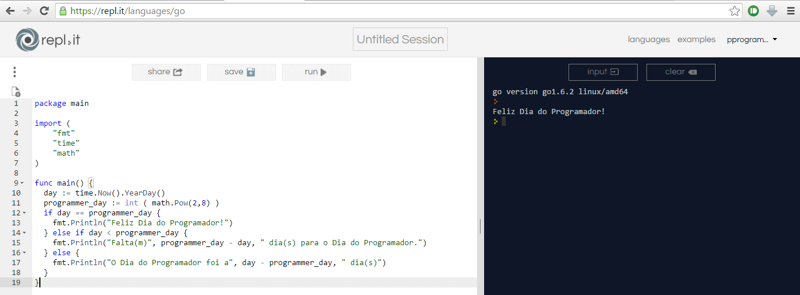

# Feliz Dia do Programador
Em comemoração ao Dia do Programador, uma pequena homenagem em algumas linguagens :)

O Dia do Programador é reconhecido internacionalmente e comemorado no dia 256 de cada ano.
O número 256 porque é o número de valores distintos que podem ser representados com um byte de oito bits, um valor bem conhecido para os programadores e por ser também a mais elevada potência de dois (elevado a oito), que é inferior a 365 (número de dias num ano).
fonte: [Wikipedia](https://en.wikipedia.org/wiki/Day_of_the_Programmer)

Todos os trechos de código podem ser testados online em [https://repl.it](https://repl.it) (exceto T-SQL)

## Linguagens usadas:
* GO
* Ruby
* Python
* Lua
* Javascript
* PHP
* T-SQL (Transact SQL / SQL Server)

## Me mostre o código...

### GO
```go
package main

import (
	"fmt"
	"time"
	"math"
)

func main() {
  day := time.Now().YearDay()
  programmer_day := int ( math.Pow(2,8) )
  if day == programmer_day {
  	fmt.Println("Feliz Dia do Programador!")
  } else if day < programmer_day {
  	fmt.Println("Falta(m)", programmer_day - day, " dia(s) para o Dia do Programador.")
  } else {
  	fmt.Println("O Dia do Programador foi a", day - programmer_day, " dia(s)")
  }
}
```

### Ruby
```ruby
time = Time.new
programmer_day = 2**8
if time.yday  == programmer_day
	puts "Feliz Dia do Programador!"
elsif time.yday < programmer_day
	puts "Falta(m) " + (programmer_day - time.yday).to_s + " dia(s) para o Dia do Programador."
else
	puts "O Dia do Programador foi a " + (time.yday - programmer_day).to_s + " dia(s)."
end
```

### Python
```python
from datetime import datetime

day = datetime.now().timetuple().tm_yday
programmers_day = 2**8

if day == programmers_day:
	print("Feliz Dia do Programador!")
elif day < programmers_day:
	print("Falta(m)", programmers_day - day, " dias para o Dia do Programador.")
else:
	print("O Dia do programador foi a", day - programmers_day, " dia(s).")
```

### Lua
```lua
day = os.date("*t").yday
programmer_day = 2^8
if day == programmer_day then
	print("Feliz Dia do Programador!")
elseif day < programmer_day then
	print("Falta(m)", programmer_day - day, " dia(s) para o Dia do Programador.")
else
	print("O Dia do Programador foi a", day - programmer_day, " dia(s).")
end
```

### Javascript
```javascript
var now = new Date();
var start = new Date(now.getFullYear(), 0, 0);
var diff = now - start;
var oneDay = 1000 * 60 * 60 * 24;
var day = Math.floor(diff / oneDay);
var programmer_day = Math.pow(2,8);
if(day == programmer_day) {
	alert("Feliz Dia do Programador!");
} else if (day < programmer_day) {
	alert("Falta(m) " + (programmer_day - day).toString() + " dia(s) para o Dia do Programador." );
} else {
	alert("O Dia do Programador foi a " + (day - programmer_day).toString() + " dia(s).")
}
```

### PHP
```php
$day = date("z") + 1;
$programmer_day = 2**8;
if($day == $programmer_day) {
	echo "Feliz Dia do Programador!";
} elseif ($day < $programmer_day) {
	echo "Falta(m)" . ($programmer_day - $day) . " dia(s) para o Dia do Programador.";
} else {
	echo "O Dia do Programador foi a " . ($day - $programmer_day) . " dia(s).";
}
```

### T-SQL (Transact SQL / SQL Server)
```sql
declare @day int, @programmer_day int
set @day = (SELECT datediff(day,CAST(datepart(year,getdate()) AS CHAR(4)) + '-01-01',getdate()+1))
set @programmer_day = power(2,8)

if @day = @programmer_day
	print 'Feliz Dia do Programador!'
else
begin
	if @day < @programmer_day
		print 'Falta(m) ' + cast(@programmer_day - @day as varchar(3)) + ' dia(s) para o Dia do Programador.'
	else
		print 'O Dia do Programador foi a ' + cast(@day - @programmer_day as varchar(3)) + ' dia(s).'
end
```

## Imagens
### GO


### Ruby


### Python


### Lua


### Javascript


### PHP


### T-SQL

